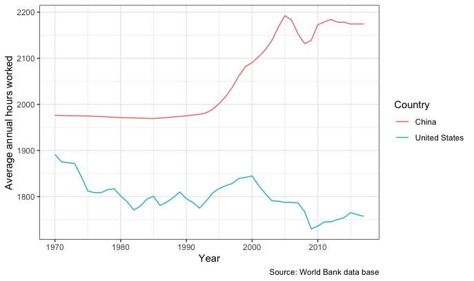

```{r echo = FALSE, message = FALSE, warning = FALSE}
# Libraries

library(tidyverse)
library(readr)
library(kableExtra)
library(bookdown)
library(DT)
library(scales)
```


```{r echo = FALSE, message = FALSE, warning = FALSE}
options(scipen = 200)
Analysis_Data <- read_csv(here::here("Data/Assignment_data.csv"))
```

class: left, top

# CONTENTS


1. Introduction (Repo Structure & Research Question)

2. China & US

3. India & UK

4. France & Mexico

5. Australia & Indonesia

6. Conclusion

---

class: center, middle
# Introduction
## Repo Stucture & Research Question

---
class: center, top
# Repo Stucture
```{r echo = FALSE, fig.align="center", eval=TRUE}

```

---
class: left, top
# Research Question
.content-box-duke-green[ 
* How do the average annual hours worked relates to the GDP in different countries from the year of 1970 to 2017?
]

.content-box-soft[ 
- Workers in rich countries tend to be shorter than workers in poor countries. Because in richer countries, workers per hour production capacity is higher, which means that people there have the higher income and less working hours. Therefore, the dramatic differences between different countries working time on how we look at the past two centuries of economic progress and the essence of the inequality between countries today has an important impact.
]

---

```{r , echo = FALSE, message = FALSE, warning = FALSE}
data <- Analysis_Data %>%
  filter(Entity %in% c("China","United States")) %>%
  filter(Year>=1970 & Year<=2017) 

data <- data %>%
  rename(Average.annual.hours.worked =
        "Average annual hours worked by persons engaged (avh) (PWT 9.1 (2019))",
        GDP.per.capita="Output-side real GDP per capita (gdppc_o) (PWT 9.1 (2019))",
        Population="Population (historical estimates)",
        Country=Entity) 

two_decimal <- function(x) round(x,2)

 overall <- data %>%
    group_by(Country) %>%
    summarise_at(c("Average.annual.hours.worked","GDP.per.capita","Population"),
                 list(Minimum = ~min(.,na.rm=TRUE), 
                      Median = ~median(.,na.rm=TRUE), 
                      Mean = ~mean(.,na.rm=TRUE))) %>%
    mutate_if(is.numeric,two_decimal) %>% 
    pivot_longer(!Country, names_sep ="_",
                 names_to = c("Variable", ".value"))%>%
   mutate(Variable=ifelse(Variable=="Average.annual.hours.worked",
                          "Hours.worked",Variable))

W1 <-ggplot(data,mapping = aes(x = Year,y=GDP.per.capita,
                           color=Country,group=Country)) +
  geom_line() +
  labs(y ="GDP per capita", 
       caption = "Source: World Bank data base")+
    theme_bw()

W2 <-ggplot(data,mapping = aes(x = Year,y=Average.annual.hours.worked,
                           color=Country,group=Country)) +
  geom_line() +
  labs(y ="Average annual hours worked", 
       caption = "Source: World Bank data base")+
    theme_bw()

W3 <- data %>%
    filter(Country=="United States")%>%
    ggplot(mapping = aes(x = Average.annual.hours.worked,
                          y=GDP.per.capita))+
    geom_point() + 
    stat_smooth(method=lm)+
  labs(x ="Average annual hours worked", 
       y ="GDP per capita", 
       caption = "Source: World Bank data base")+
    theme_bw()
```

## China and The United States

<br>
<br>

**Q1: How do the Average annual hours worked relates to the GDP between China and The United States
<br>
<br>

**Q2: What is the trend of GDP between China and The United States

---

## Descriptive statistical analysis of China and The United States

```{r,echo = FALSE, warning = FALSE, message = FALSE, fig.align="center",out.width = '80%'}
knitr::include_graphics("figs/Rplot04.png")
```

---

## GDP per capita between China and The United States.

```{r,echo = FALSE, warning = FALSE, message = FALSE, fig.align="center",out.width = '80%'}
knitr::include_graphics("figs/Rplot.png")
```

---
## Average annual work hours between China and The United States.

```{r,echo = FALSE, warning = FALSE, message = FALSE, fig.align="center",out.width = '80%'}

```

---
## The relation between Average annual hours worked and GDP per capita in The United States
```{r,echo = FALSE, warning = FALSE, message = FALSE, fig.align="center",out.width = '80%'}
knitr::include_graphics("figs/Rplot02.png")
```
---
## The relation between Average annual hours worked and GDP per capita in China
```{r,echo = FALSE, warning = FALSE, message = FALSE, fig.align="center",out.width = '80%'}
knitr::include_graphics("figs/Rplot03.png")
```

---
class: center, top

# INDIA AND UNITED KINGDOM

.pull-left[

]


.pull-right[

]
]


---
.content-box-soft[For **India and United Kingdom**, GDP and Annual working hours data from 1970 to 2017, lets calculate average of GDP and Working hours from 1970 to 2017]


```{r echo=FALSE, message=FALSE}
Ind_UK_Data <- Analysis_Data %>%
    filter(Entity %in% c("India", "United Kingdom") & Year >= 1970 & Year <= 2017) %>%
    rename(Country = "Entity",
           Avg_Annual_Working_Hours = "Average annual hours worked by persons engaged (avh) (PWT 9.1 (2019))", 
           GDP = "Output-side real GDP per capita (gdppc_o) (PWT 9.1 (2019))", 
           Population = "Population (historical estimates)")

Avg_GDP_WH <- Ind_UK_Data %>%
    group_by(Country) %>%
    summarise(avg_GDP = mean(GDP), avg_working_hrs = mean(Avg_Annual_Working_Hours))

kable(Avg_GDP_WH, caption = "Average GDP and Working hours of India and United Kingdrom from 1970 to 2017", align = "c") %>%
    kable_classic_2(full_width = F)
```

.content-box-duke-green[From the above table, we see that despite India has more average working hours than United Kingdom, the average vale of GDP of United Kingdom is very high than India which means, for India and United Kingdom, GDP does not depend on Working hours solely, there are other factors as well.
]

---
class: center, top

.content-box-soft[To understand this, let's create a figure and see the trend in GDP and average working hours in India and United Kingdom.]

```{r echo=FALSE, message=FALSE}
p1 <- ggplot(Ind_UK_Data, aes(x = Year, 
                        y = Avg_Annual_Working_Hours,
                        color = Country)) + geom_line() +
    ylab("Avg Work Hrs (Annual)") + labs(title = "Avg Work Hrs of India and UK from 1970 to 2017") + theme_bw()


p2 <- ggplot(Ind_UK_Data, aes(x = Year, 
                        y = GDP,
                        color = Country)) + geom_line() + 
    labs(title = "GDP each year of India and UK from 1970 to 2017") + theme_bw()


gridExtra::grid.arrange(p1,p2, nrow=2)

```

---

class: center, middle

.content-box-soft[From the above plots, it is clear that in India, the Average working hours and GDP both are increasing but not as compared to UK. On the other hand, in UK, Average working hours are decreasing continuously while GDP is going up. Therefore, GDP does not solely depend on working hours or we can say that, in richer country, UK, people work for lesser number of hours as compared to India with low GDP. In India, the population has increased to a great extent and in UK, the increase has not been that much, therefore this huge increase in population might be another reason for India's falling short in GDP growth.]


---
class: center, middle

# France & Mexico

---
class: left, top
# Country Background
- .bold[France is a developed country]
- .bold[Mexico is a developing country]

# Stucture of this section
- .bold[Observe the developing trend with the changes of working hours and GDP within each country]
- .bold[Compare these two diffrent counties to calculate their average working time and GDP]

```{r echo = FALSE, warning=FALSE, message=FALSE}
#process data
sec3_data <- Analysis_Data %>%
  filter(Entity %in% c("France", "Mexico"),
         Year >= 1970) %>%
  rename(Country = Entity,
         Ave_working_hours = 'Average annual hours worked by persons engaged (avh) (PWT 9.1 (2019))',
         GDP = 'Output-side real GDP per capita (gdppc_o) (PWT 9.1 (2019))',
         Population = 'Population (historical estimates)')
```

---
class: left, middle
```{r timechanges, echo = FALSE, warning=FALSE, message=FALSE, out.width = '80%', fig.height=4, fig.cap="The Development of Average Working Hours and GDP with the Year Changes"}
sec3_figure <- sec3_data %>%
  pivot_longer(cols = "Ave_working_hours":"GDP",
               names_to = "type",
               values_to = "workinghours_or_GDP") 

  ggplot(sec3_figure) +
  geom_line(aes(x = Year,
                y = workinghours_or_GDP,
                color = Country)) +
  facet_wrap(~type, scales = "free_y")
```


- The left part figure shows that the average annual hours worked by persons are gradually decreased in both of two countries from the year of 1970 to 2017. 

- The right part figure indicates that the overall trend of the output-side real GDP per capita  shows a continuous rise in the same period.

---
class: left, middle
```{r relationship, echo = FALSE, warning=FALSE, message=FALSE, out.width='80%', fig.height=4, fig.cap="The Camparation between Average Working Hours and GDP"}
ggplot(sec3_data) +
    geom_line(aes(x = GDP,
                  y = Ave_working_hours,
                  color = Country)) 
```

- The figure above shows that the per capita working hours in France and Mexico show a declining trend as GDP increases.

---
class: left, middle
```{r echo = FALSE, warning=FALSE, message=FALSE}
sec3_table <- sec3_data %>%
  group_by(Country) %>%
  summarise(Working_hours = round(mean(Ave_working_hours, na.rm = TRUE),0),
            GDP = round(mean(GDP, na.rm = TRUE),0))
```

```{r comparation, echo = FALSE, warning=FALSE, message=FALSE, fig.align="center", out.width='80%', fig.height=6}
kable(sec3_table, booktabs = TRUE, caption = "The Comparation of Average Working Hours and GDP between France and Mexico")
``` 

- It can be found from the table that the France has a lower working hours and a higher GDP compared with Mexico with 1,640 hours and 26,998 dollors respectively. And people in Mexico work around 2,297 hours and GDP per capita is around 12,339 dollors.

---

class: center, middle

.content-box-duke-green[ 
* While average earnings have risen, hours worked have fallen. 
]

.content-box-duke-green[ 
* Working hours tend to decrease as countries become richer.
]

---

class: center, middle

# Australia & Indonesia

.pull-left[


]

.pull-right[


]

.tiny[
source : [https://flaglane.com/](https://flaglane.com/)
]

---

class: left, top

### Australia & Indonesia

```{r au_idn, echo=FALSE}
au_idn <- Analysis_Data %>%
  rename(Country = "Entity", 
         avh = "Average annual hours worked by persons engaged (avh) (PWT 9.1 (2019))",
         gdp = "Output-side real GDP per capita (gdppc_o) (PWT 9.1 (2019))") %>%
  select(Country, Year, avh, gdp) %>%
  filter(Country %in% c("Australia", "Indonesia"), 
         Year >=1970 & Year <=2017)
```


.pull-left[
```{r avh, echo=FALSE}
au_idn %>% 
  ggplot(aes(x = Year, 
             y = avh, 
             color = Country)) +
  geom_line(show.legend = FALSE) +
    labs(x = "Year",
         y = "hours",
         title = "Average annual hours worked by workers from year 1970-2017") +
  scale_y_continuous(labels = label_number(big.mark = ",")) +
  theme_linedraw() 
  
```
]

.pull-right[
```{r gdp, echo=FALSE}
au_idn %>% 
  ggplot(aes(x = Year, 
             y = gdp, 
             color = Country)) +
  geom_line()+
    labs(x = "Year",
         y = "USD",
         title = "GDP per capita from year 1970-2017",
         ) +
  scale_y_continuous(labels = label_number(prefix="$", big.mark = ",")) +
  theme_linedraw() 
  
```
]

---
class: left, top

### Australia & Indonesia

```{r avg_avh_gdp, echo=FALSE}
au_idn %>% 
    group_by(Country) %>%
    summarise(avg_avh = mean(avh),
              avg_gdp = mean(gdp)) %>%
  kable(col.names = c("Country", 
                      "Average of the Average Annual Working Hours (hours)", 
                      "Average of GDP per capita (USD)"), 
        digits = 2,
        align = "lcr",
        caption = "The Comparation of Average Annual Working Hours and GDP between Australia and Indonesia") %>%
  kable_styling(full_width = F, 
                bootstrap_options = c("striped", "hover", "condensed"))
```

.content-box-duke-green[ 
 ** Less working hours resulted in higher GDP **
]

---

# Conclusion

For this study, we took 8 countries ( China, USA, India, UK, France, Mexico, Australia & Indonesia) and analysed their respective GDP growth with respect to Hours of Work which each person does on an average in one year. After the analyzation, we found that GDP growth does not solely depend on Working hours and also, people in richer countries work for lesser number of hours. There can be many factors for this like population and how efficiently people are working and what are the resources available for people in rich countries with the help of which they are able to complete more work in less number of hours.  


