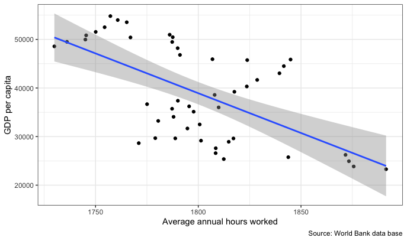

```{r , echo = FALSE, message = FALSE, warning = FALSE}
# Libraries

library(tidyverse)
library(readr)
library(kableExtra)
library(bookdown)
library(DT)
```

```{r , echo = FALSE, message = FALSE, warning = FALSE}
options(scipen = 200)
Analysis_Data <- read_csv(here::here("Data/Assignment_data.csv"))
```
---
class: center, middle
# Introduction
## Repo Stucture & Research Question
---
class: center, top
# Repo Stucture
```{r out.width = '80%', echo = FALSE, fig.align="center"}
knitr::include_graphics("figs/ ... .jpeg")
```

---
class: left, top
# Research Question
.content-box-duke-green[ 
* How do the average annual hours worked relates to the GDP in different countries from the year of 1970 to 2017?
]

.content-box-soft[ 
- Workers in rich countries tend to be shorter than workers in poor countries. Because in richer countries, workers per hour production capacity is higher, which means that people there have the higher income and less working hours. Therefore, the dramatic differences between different countries working time on how we look at the past two centuries of economic progress and the essence of the inequality between countries today has an important impact.
]

---
class: center, middle
# Section Three
# France & Mexico

---
class: left, top
# Country Background
- .bold[France is a developed country]
- .bold[Mexico is a developing country]

# Stucture of this section
- .bold[Observe the developing trend with the changes of working hours and GDP within each country]
- .bold[Compare these two diffrent counties to calculate their average working time and GDP]

```{r echo = FALSE, warning=FALSE, message=FALSE}
#process data
sec3_data <- Analysis_Data %>%
  filter(Entity %in% c("France", "Mexico"),
         Year >= 1970) %>%
  rename(Country = Entity,
         Ave_working_hours = 'Average annual hours worked by persons engaged (avh) (PWT 9.1 (2019))',
         GDP = 'Output-side real GDP per capita (gdppc_o) (PWT 9.1 (2019))',
         Population = 'Population (historical estimates)')
```

---
class: left, middle
```{r timechanges, echo = FALSE, warning=FALSE, message=FALSE, out.width = '80%', fig.height=4, fig.cap="The Development of Average Working Hours and GDP with the Year Changes"}
sec3_figure <- sec3_data %>%
  pivot_longer(cols = "Ave_working_hours":"GDP",
               names_to = "type",
               values_to = "workinghours_or_GDP") 

  ggplot(sec3_figure) +
  geom_line(aes(x = Year,
                y = workinghours_or_GDP,
                color = Country)) +
  facet_wrap(~type, scales = "free_y")
```

- The left part figure shows that the average annual hours worked by persons are guadually decreased in both of two countries from the year of 1970 to 2017. 

- The right part figure indicates that the overall trend of the output-side real GDP per capita  shows a continuous rise in the same period.

---
class: left, middle
```{r relationship, echo = FALSE, warning=FALSE, message=FALSE, out.width='80%', fig.height=4, fig.cap="The Camparation between Average Working Hours and GDP"}
ggplot(sec3_data) +
    geom_line(aes(x = GDP,
                  y = Ave_working_hours,
                  color = Country)) 
```

- The Figure \@ref(fig:relationship) shows that the per capita working hours in France and Mexico show a declining trend as GDP increases.

---
class: left, middle
```{r echo = FALSE, warning=FALSE, message=FALSE}
sec3_table <- sec3_data %>%
  group_by(Country) %>%
  summarise(Working_hours = round(mean(Ave_working_hours, na.rm = TRUE),0),
            GDP = round(mean(GDP, na.rm = TRUE),0))
```

```{r comparation, echo = FALSE, warning=FALSE, message=FALSE, fig.align="center", out.width='80%', fig.height=6}
kable(sec3_table, booktabs = TRUE, caption = "The Comparation of Average Working Hours and GDP between France and Mexico")
``` 

- It can be found from the table that the France has a lower working hours and a higher GDP compared with Mexico with 1,640 hours and 26,998 dollors respectively. And people in Mexico work around 2,297 hours and GDP per capita is around 12,339 dollors.

---
# Conclusion (France & Mexico)

.content-box-duke-green[ 
* While average earnings have risen, hours worked have fallen. 
]

.content-box-duke-green[ 
* Working hours tend to decrease as countries become richer.
]

---
class: left, top
# Reference

Ibarra, Carlos A, & Ros, Jaime. (2019). The decline of the labor income share in Mexico, 1990–2015. World Development, 122, 570–584. https://doi.org/10.1016/j.worlddev.2019.06.014

Haller, Alina-Petronela. (2017). Growth Through Tourism in Developed European Countries. Case Study: France, Italy and Spain. EcoForum (Suceava.), 6(1), 0–0.

Charlie Giattino & Esteban Ortiz-Ospina. (2020). Do workers in richer countries work longer hours? Our World in Data. Retrived from:  https://ourworldindata.org/rich-poor-working-hours


```{r , echo = FALSE, message = FALSE, warning = FALSE}
data <- Analysis_Data %>%
  filter(Entity %in% c("China","United States")) %>%
  filter(Year>=1970 & Year<=2017) 

data <- data %>%
  rename(Average.annual.hours.worked =
        "Average annual hours worked by persons engaged (avh) (PWT 9.1 (2019))",
        GDP.per.capita="Output-side real GDP per capita (gdppc_o) (PWT 9.1 (2019))",
        Population="Population (historical estimates)",
        Country=Entity) 

two_decimal <- function(x) round(x,2)

 overall <- data %>%
    group_by(Country) %>%
    summarise_at(c("Average.annual.hours.worked","GDP.per.capita","Population"),
                 list(Minimum = ~min(.,na.rm=TRUE), 
                      Median = ~median(.,na.rm=TRUE), 
                      Mean = ~mean(.,na.rm=TRUE))) %>%
    mutate_if(is.numeric,two_decimal) %>% 
    pivot_longer(!Country, names_sep ="_",
                 names_to = c("Variable", ".value"))%>%
   mutate(Variable=ifelse(Variable=="Average.annual.hours.worked",
                          "Hours.worked",Variable))

W1 <-ggplot(data,mapping = aes(x = Year,y=GDP.per.capita,
                           color=Country,group=Country)) +
  geom_line() +
  labs(y ="GDP per capita", 
       caption = "Source: World Bank data base")+
    theme_bw()

W2 <-ggplot(data,mapping = aes(x = Year,y=Average.annual.hours.worked,
                           color=Country,group=Country)) +
  geom_line() +
  labs(y ="Average annual hours worked", 
       caption = "Source: World Bank data base")+
    theme_bw()

W3 <- data %>%
    filter(Country=="United States")%>%
    ggplot(mapping = aes(x = Average.annual.hours.worked,
                          y=GDP.per.capita))+
    geom_point() + 
    stat_smooth(method=lm)+
  labs(x ="Average annual hours worked", 
       y ="GDP per capita", 
       caption = "Source: World Bank data base")+
    theme_bw()

class: center, middle


---
class: center, middle
# Hello!

Dr Patricia Menéndez
```{r out.width = '35%', echo = FALSE, fig.align="center"}


```
---

## Interested Country: China and The United States

<br>
<br>
--
**Q1: How do the Average annual hours worked relates to the GDP between China and The United States
<br>
<br>
--
**Q2: What is the trend of GDP between China and The United States

---

## Descriptive statistical analysis of China and The United States

```{r, echo = FALSE, message = FALSE, warning = FALSE}
datatable(overall)
```

---

## GDP per capita between China and The United States.

```{r,echo = FALSE, warning = FALSE, message = FALSE, fig.align="center",out.width = '80%'}
knitr::include_graphics("figs/Rplot.png")
```

---
## Average annual work hours between China and The United States.

```{r,echo = FALSE, warning = FALSE, message = FALSE, fig.align="center",out.width = '80%'}
knitr::include_graphics("figs/Rplot01.png")
```

---
## The relation between Average annual hours worked and GDP per capita in The United States
```{r,echo = FALSE, warning = FALSE, message = FALSE, fig.align="center",out.width = '80%'}

```
---
## The relation between Average annual hours worked and GDP per capita in China
```{r,echo = FALSE, warning = FALSE, message = FALSE, fig.align="center",out.width = '80%'}
knitr::include_graphics("figs/Rplot03.png")
```


